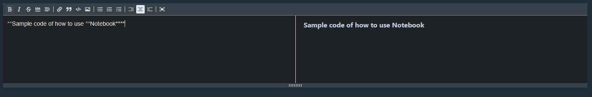
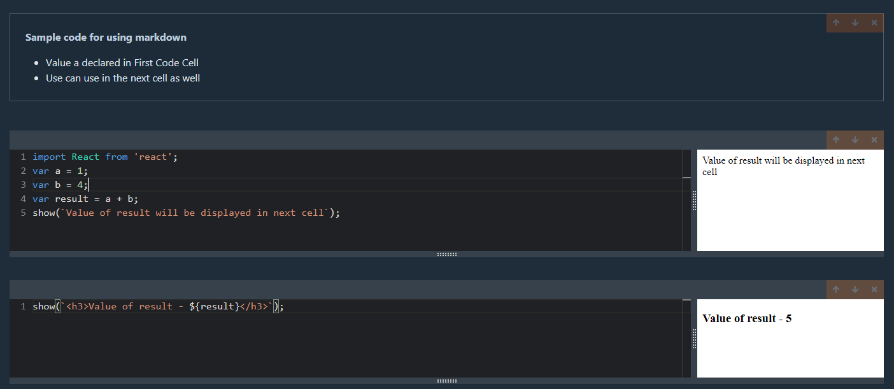

# javascript-code-book-pm v2.0.1

## Installation

Using npm: 

```
$ npm install -g javascript-code-book-pm
$ npx javascript-code-book-pm serve
$ npx javascript-code-book-pm serve --port=<Port Number>
$ npx javascript-code-book-pm serve <notebook.js(File name for storing code cells data)>
```

**After running this command notebook will be opened on localhost:4005**

### Documentation

- After opening a notebook you will be able to see below screen. You can either add code block or Mark-Editor Block. Use can add N number of Markdown and Code Cell in notebook

      

- User can add a Markdown-Editor by Clickingon text button and prepare a document for Code.

  
  
- User can write code in different cell and it will be compiled as cumulative code in active cell as below. Use can use show function for writing HTML tags as welll as user can import different modules

  
  
**Note - This notebook is made for learning purpose. It's only supported for Latest NodeJs Version 14 and above and it's not stable yet.**


